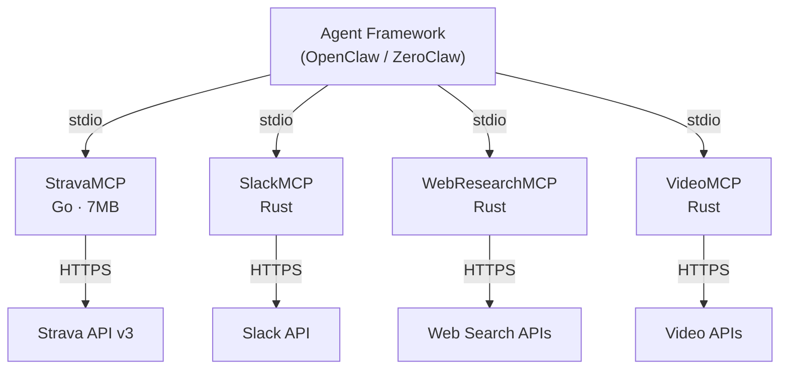

# Agent Framework Integration
{: .fs-9 }

Wire StravaMCP into OpenClaw/ZeroClaw agent frameworks as a stdio tool provider.
{: .fs-6 .fw-300 }

[Quick Start](/#quick-start){: .btn .btn-primary .fs-5 .mb-4 .mb-md-0 .mr-2 }
[View on GitHub](https://github.com/shotah/go-strava-mcp){: .btn .fs-5 .mb-4 .mb-md-0 }

---

## What is OpenClaw/ZeroClaw?

OpenClaw and ZeroClaw are agent framework ecosystems that orchestrate AI agents with access to external services. Each service is exposed as an MCP (Model Context Protocol) server that communicates over stdio transport -- the agent framework launches each server as a subprocess and routes tool calls through the standard MCP protocol.

StravaMCP is one of several high-performance MCP servers in this ecosystem. Unlike typical Python or JavaScript MCP servers that require interpreter runtimes and large dependency trees, the RustyClaw ecosystem favors compiled languages (Go, Rust) for sub-second startup, minimal memory footprint, and zero-dependency deployment.

## Ecosystem Architecture



- Starts in milliseconds (no interpreter warm-up)
- Uses minimal memory (single-digit MB at idle)
- Communicates over stdio (no HTTP server, no port conflicts)
- Handles its own authentication and API access

## Wiring Configuration

Add StravaMCP to your agent framework's MCP server configuration. The agent framework launches the binary as a subprocess and communicates over stdin/stdout:

```json
{
  "mcpServers": {
    "strava": {
      "command": "strava-mcp",
      "env": {
        "STRAVA_CLIENT_ID": "your_client_id",
        "STRAVA_CLIENT_SECRET": "your_client_secret"
      }
    }
  }
}
```

### Environment Variables

| Variable | Required | Description |
|----------|----------|-------------|
| `STRAVA_CLIENT_ID` | Yes | Your Strava API application client ID |
| `STRAVA_CLIENT_SECRET` | Yes | Your Strava API application client secret |
| `STRAVA_TOKEN_PATH` | No | Custom path to token storage (default: ~/.strava/tokens.json) |

### First-Time Setup

1. Export your Strava API credentials:

   ```bash
   export STRAVA_CLIENT_ID=your_client_id
   export STRAVA_CLIENT_SECRET=your_client_secret
   ```

2. Run the built-in OAuth flow to authenticate:

   ```bash
   strava-mcp auth
   ```

   This opens your browser, completes authorization, and saves tokens locally.

3. After authentication, tokens are stored locally and refreshed automatically. The agent framework can launch StravaMCP without any manual steps on subsequent runs.

## Example Workflows

### Training Log Analysis

An agent can pull recent activities, retrieve detailed telemetry, and summarize training patterns:

1. `strava_get_activities` -- fetch the last 30 days of activities
2. `strava_get_activity_streams` -- get heart rate, power, and pace data for each activity
3. `strava_get_athlete_stats` -- compare recent totals against year-to-date and all-time stats

### Activity Journaling

An agent can enrich activities with notes, descriptions, and metadata:

1. `strava_get_activities` -- list recent activities
2. `strava_get_activity_by_id` -- get full details for a specific activity
3. `strava_update_activity` -- add or update the description, name, or gear
4. `strava_get_activity_zones` -- include heart rate zone distribution in the journal entry

### Club Activity Monitoring

An agent can track club member activities for leaderboards or summaries:

1. `strava_get_club_activities` -- fetch recent activities from all club members

## Performance Characteristics

- Sub-second startup (~10ms)
- Minimal memory (~8MB)
- Small binary (7MB)
- Zero runtime -- no Python interpreter, no Node.js runtime, no virtual environment

For the full performance comparison, see [Why Go?](/#why-go) on the home page.
